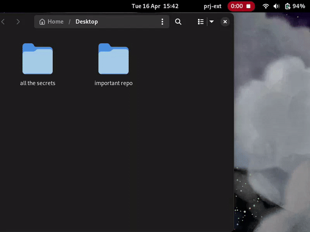

# Wechsel Gnome Extension
Organize your Computer by creating a set of home folder subdirectories per project.

This is the Gnome Extension for the [Wechsel](https://github.com/JustSomeRandomUsername/wechsel) cli utility.

To use this extension you need to have the Wechsel cli utility installed on your system. Refer to the [Wechsel installation](https://github.com/JustSomeRandomUsername/wechsel?tab=readme-ov-file#installation) for more information.

